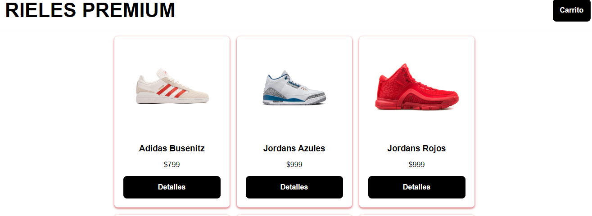

# Shoe Website

En este proyecto se usaron tecnologías como: Vue.js, MongoDB, Axios, Express, Babel, MongoDB Atlas y Heroku, entre otras.

**Se puede ver la pagina de esta manera**

1. Clonar este repositorio 
2. Entrar a la carpeta del front-end
3. `npm install`
4. `npm install -g @vue/cli`
5. Entrar al folder del back-end
6. `npm install express`
7. `npm install --save-dev @babel/core @babel/node @babel/preset-env @babel/cli `
8. `npm install @babel/runtime`
9. `npm install body-parser`
10. `npm install --save-dev nodemon`
11. Y por ultimo
12. `npm run dev`
13. Eso abrira un localhost con la pagina

# Herramientas usadas :wrench:
* Vue.js
* MongoDB, MongoDB  Atlas
* Express
* Babel

> Para mas informacion sobre tecnologias usadas se puede ver: [package.json](/package.json)

